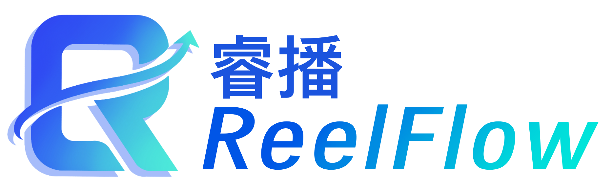

    <h1>
        ReelFlow - 睿播
    </h1>
    
    
    
    
     
    

ReelFlow - 睿播 是一款面向**多设备、多场景**的智能化多媒体内容发布与管理系统。它旨在解决传统信息展示效率低下、管理困难的痛点。 

通过搭建使用ReelFlow，用户可以轻松地将视频、图片轮播、通知等内容，实时、精准地推送到任意数量的终端设备上，实现内容的“一键发布，多端同步”。此外，ReelFlow还支持定时内容更新、设备通知弹幕等丰富功能，让信息管理和发布变得的高效、安全与便捷。 

## Features

- 设备集群：ReelFlow支持多设备集群，用户可以轻松将内容推送到任意数量的终端设备上。同时ReelFlow支持设备分组，用户可以将不同的内容推送到不同的设备组中。

- 素材分组：ReelFlow支持自定义多组素材，用户可以向不同的设备组推送不同的素材内容。

- 定时更新：ReelFlow支持为设备组编排日程，可以高效地定时更新指定的内容。

- 实时推送：ReelFlow支持提示用户组下线的设备，实时更新轮播内容等等。